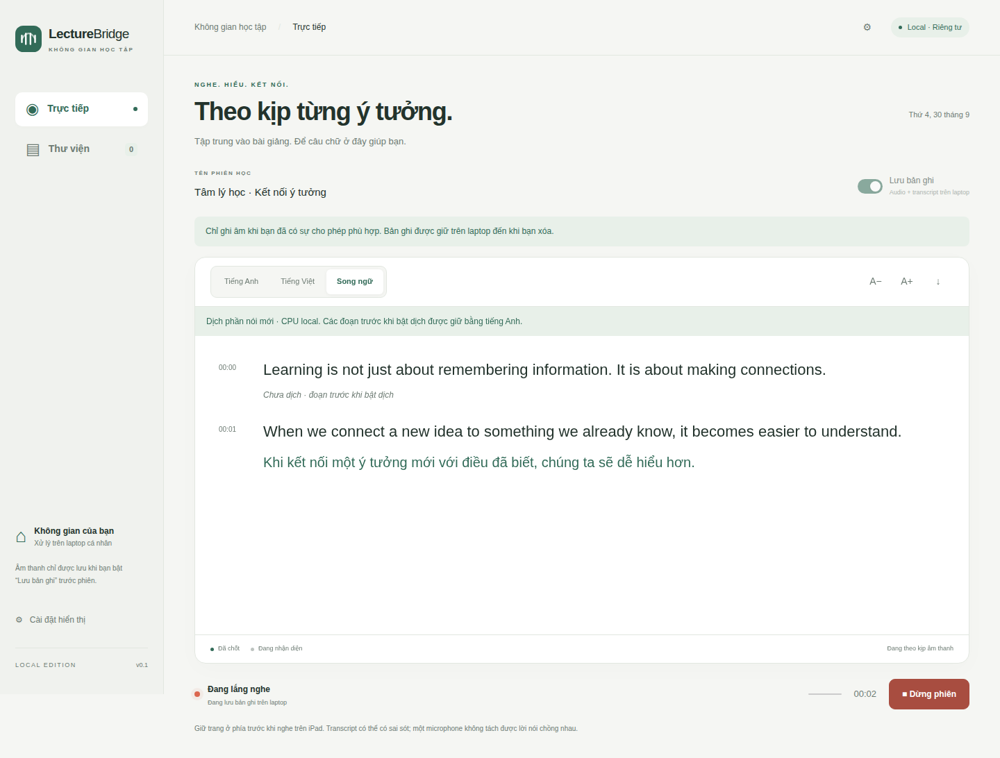

<a name="lecturebridge"></a>

<p align="center">
  
</p>

<h1 align="center">LectureBridge</h1>

<p align="center">
  <a href="https://github.com/Nguyen-Le-Tuan/lecturebridge/releases"></a>
  <a href="#download-and-install"></a>
  <a href="#recordings-and-privacy"></a>
  <a href="LICENSE"></a>
</p>

<p align="center">
  <strong>Language:</strong>
  <a href="docs/getting-started.md">English</a> |
  <a href="docs/i18n/getting-started.vi.md">Tiếng Việt</a> |
  <a href="docs/i18n/getting-started.zh-Hans.md">简体中文</a> |
  <a href="docs/i18n/getting-started.zh-Hant.md">繁體中文</a> |
  <a href="docs/i18n/getting-started.ja.md">日本語</a> |
  <a href="docs/i18n/getting-started.ko.md">한국어</a>
</p>

<p align="center">
  <a href="https://github.com/Nguyen-Le-Tuan/lecturebridge/releases"><strong>Download</strong></a>
  &nbsp; · &nbsp; <a href="#studio-preview">Studio preview</a>
  &nbsp; · &nbsp; <a href="docs/models.md">Model guide</a>
  &nbsp; · &nbsp; <a href="docs/testing.md">Testing</a>
  &nbsp; · &nbsp; <a href="#testing-and-feedback">Feedback</a>
</p>

---

I'm building LectureBridge to make lectures easier to follow with live captions.
It transcribes **English, Mandarin Chinese, Japanese, and Korean**, and can
translate the transcript into **Vietnamese**.

Run it on a Windows or Ubuntu computer and open the studio in your browser.
You can use the computer's microphone, or connect an iPhone/iPad through
Tailscale HTTPS. Speech recognition and translation run on your computer.

> **Alpha preview** — Start with a short session. Classroom accuracy and longer
> sessions still need testing, and translation can lag by tens of seconds.
> Recording is off unless you turn it on.

| Read along | Translate when needed | Keep what matters |
| :--- | :--- | :--- |
| Live captions in English, Mandarin, Japanese, or Korean. | Original text, Vietnamese, or both in the same reading view. | Optional audio recording, playback, and WAV/TXT/JSON export. |

## Download and install

New to local speech tools? Start with the [step-by-step setup guide](docs/getting-started.md),
available in the six languages linked above. These links change the guide
language; the app's speech and translation settings are selected separately.

Get the Windows ZIP or Ubuntu archive from
[Releases](https://github.com/Nguyen-Le-Tuan/lecturebridge/releases).
If you received an archive directly, use that file. While the repository is
private, GitHub downloads require repository access.

| Windows 10/11, x86-64 | Ubuntu 22.04/24.04, x86-64 |
| --- | --- |
| Extract the entire Windows ZIP into a folder you can keep. | Extract the entire Ubuntu archive into a folder you can keep. |
| Double-click **Install.cmd**. | Open a terminal there and run **`bash Install.sh`**. |
| Choose your spoken language and wait for **Setup complete**. | Choose your spoken language and wait for **Setup complete**. |
| Double-click **Start.cmd**. | Run **`bash Start.sh`**. |

Install sets up Python, the application libraries, and a starting speech model.
You don't need Git, Python, or CUDA Toolkit installed beforehand. Windows may
ask you to approve the Microsoft Visual C++ installer; Ubuntu may ask for your
`sudo` password to install missing system packages.

You'll need an internet connection, at least **4 GB RAM**, and **20 GB free**
on the installation drive. Setup downloads several GB of libraries. Keep at
least 2 GB free on the model-cache drive for the initial speech models;
translation needs about another 2.5 GB. Allow more space for recordings and
additional models.

Keep the extracted folder in place after installing. To update, extract the
new version into a separate folder and run Install there. Your saved recordings
stay in your user data directory.

For installation options and recovery, see the [Windows guide](docs/setup-windows.md)
or [Ubuntu guide](docs/setup-linux.md).

## Studio preview



*The actual studio interface with synthetic demo text from the UI test fixture.
The interface is currently in Vietnamese; this preview is not an accuracy benchmark.*

## Your first session

Start opens [localhost:8000](http://127.0.0.1:8000) when the server is ready.
Allow microphone access and speak for 15–30 seconds. Keep the terminal open
while you use the app. Stop the session in the browser, then press **Ctrl+C**
in the terminal when you're done.

The studio interface is currently in Vietnamese. You can:

- Read the original transcript, a Vietnamese translation, or both side by side.
- Switch between light and dark themes and adjust the text size.
- Turn on recording before a session to keep its audio and transcript.
- Replay saved sessions, seek from transcript timestamps, rename recordings,
  and export WAV, TXT, or JSON files.
- Export the current transcript without saving an audio recording.

To try translation, select Vietnamese or bilingual mode and approve the model
download. Translation starts with newly committed text; earlier paragraphs
aren't translated retroactively. NLLB runs on CPU with two threads, so a faster
GPU won't directly reduce translation delay.

Each server supports one microphone session at a time, up to two hours.
After a disconnect, start a new session. If recording was enabled, the audio
already received by the server is retained.

## Languages and models

Install asks which language you'll speak and selects a multilingual `tiny`,
`base`, or `small` model based on RAM and available GPU memory. If GPU support
is unavailable, it uses `tiny` on CPU. Larger models are available when you're
ready to compare them.

| Spoken language | Code |
| --- | --- |
| English | `en` |
| Mandarin Chinese | `zh` |
| Mandarin with the Traditional Chinese translation-source setting | `zh-Hant` |
| Japanese | `ja` |
| Korean | `ko` |

<details>
<summary><strong>Change the spoken language</strong></summary>

To change languages, close the server and restart it with the new code:

```powershell
# Windows: Mandarin Chinese
.\Start.cmd --language zh
```

```bash
# Ubuntu: Japanese
bash Start.sh --language ja
```

Start remembers your choice. `zh-Hant` uses the same Mandarin speech recognizer
as `zh`; it changes the translation source token and does not guarantee
Traditional characters in the transcript.


</details>

See the [model guide](docs/models.md) for download sizes and commands from
`tiny.en` through `large-v3`. Chinese, Japanese, and Korean require multilingual
models. The `.en` models and `distil-large-v3.5` support English only.

## GPU use

The installer checks hardware and downloads files without running inference.
It leaves GPU drivers unchanged. On the first GPU launch, and after a GPU or
driver change, Start runs a bounded check using `tiny` and one second of silence.
If that check fails, the session starts on CPU.

The check stops at 60 seconds, 75°C, or less than 1024 MiB free VRAM. It reduces
the length of the test but cannot prevent every driver or system failure.
**The live server has no thermal watchdog.** Keep initial sessions short and
stop if the machine gets hot or responds poorly.

Use the CPU profile if you prefer to avoid GPU inference. Profile commands and
model-selection thresholds are in the platform setup guides.

## Recordings and privacy

Recording resets to off after each session. Saved recordings stay on your
computer until you delete them:

| System | Library location |
| --- | --- |
| Windows | `%LOCALAPPDATA%\LectureBridge` |
| Ubuntu | `${XDG_DATA_HOME:-~/.local/share}/lecturebridge` |

Removing the application folder doesn't remove the library or the Hugging Face
model cache. Windows and Ubuntu installations on a dual-boot machine have
separate libraries.

Get permission before capturing a class or conversation. Audio is processed
locally; installation and model downloads contact external package and model
hosts. A single microphone won't reliably separate overlapping speakers, and
captions can contain mistakes.

For phone or tablet access, follow the [Tailscale runbook](docs/classroom-runbook.md).
Keep Safari in the foreground. Anyone allowed to reach your server can access
its recording library, so restrict access to people you trust. Public internet
hosting and Tailscale Funnel are unsupported.

## Testing and feedback

If you're trying LectureBridge, I'd like to know where captions are useful and
where they fall behind. The [testing guide](docs/testing.md) walks through short
sessions, recording, translation, and optional phone/tablet checks. Use the
[report template](docs/acceptance-report-template.md) to include your version,
hardware, model, source language, and the steps that caused a problem.

Share short examples you have permission to share. Keep private recordings,
transcripts, credentials, and personal details out of issues and logs.
For setup problems, start with [troubleshooting](docs/troubleshooting.md).

## Development

See [CONTRIBUTING.md](CONTRIBUTING.md) for setup, tests, and pull requests.
[How it works](docs/how-it-works.md) introduces the components;
[the architecture notes](docs/local-studio-architecture.md) cover implementation
details. Maintainers can use the [release checklist](docs/release-checklist.md)
to prepare an alpha or stable release.

## License

LectureBridge's source and project documentation use the [MIT License](LICENSE).
Models and dependencies have their own licenses, listed in
[third-party notices](THIRD_PARTY_NOTICES.md). The optional NLLB translation
weights use **CC-BY-NC-4.0** and are restricted to non-commercial use.

---

<p align="center">
  <a href="https://github.com/Nguyen-Le-Tuan/lecturebridge/releases">Get LectureBridge</a>
  &nbsp; · &nbsp; <a href="docs/acceptance-report-template.md">Share a test report</a>
  &nbsp; · &nbsp; <a href="#lecturebridge">Back to top ↑</a>
</p>
